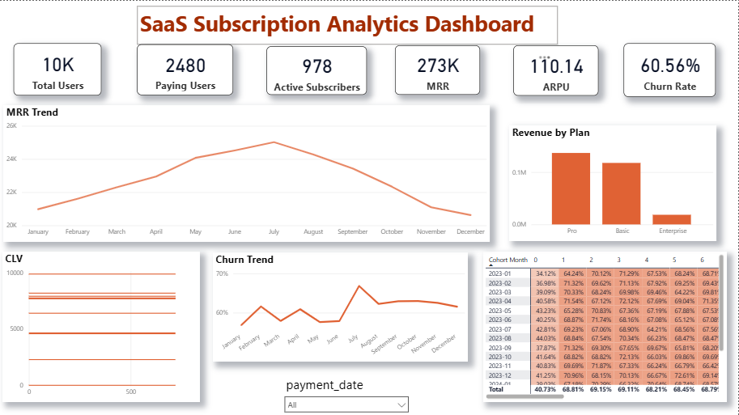

# SaaS Customer Retention & Cohort Analysis
### SaaS Analytics Project | SQL • Python • Power BI

Customer Retention & Cohort Analysis for a **SaaS subscription business** to understand customer behavior, revenue growth, churn patterns, and customer lifetime value.

This project combines **SQL analysis, Python exploration, and Power BI dashboards** to generate actionable insights for subscription-based businesses.

---

# Dashboard Preview

---

# Executive Summary

Subscription businesses depend heavily on **customer retention and recurring revenue**. Understanding how users behave after signup is critical for long-term growth.

This project analyzes a SaaS subscription dataset to answer key business questions:

- How does **Monthly Recurring Revenue (MRR)** change over time?
- What is the **customer churn trend**?
- How long do users remain active after signup?
- What is the **Average Revenue Per User (ARPU)**?
- Which customers generate the **highest lifetime value (CLV)**?

### Key Insights

- Platform contains **10K users and ~2.4K paying customers**
- **MRR peaked mid-year before declining**, indicating potential churn
- **Average Revenue Per User (ARPU) ≈ 110**
- Cohort analysis shows **retention drops significantly after early months**
- A small group of customers contributes **high lifetime value**

### Business Impact

The analysis highlights opportunities to:

- Improve **early-stage user retention**
- Reduce **customer churn**
- Identify **high-value customer segments**
- Optimize **subscription pricing and plans**

---

# Business Problem

SaaS companies often struggle to understand:

- Why customers **cancel subscriptions**
- When users **stop using the product**
- How revenue evolves through **subscription payments**
- Which users create **long-term business value**

Without proper retention analysis, businesses risk losing customers without understanding the underlying causes.

This project builds a **data-driven framework** to analyze customer retention and revenue behavior using cohort analysis.

---

# Dataset

The dataset used in this project is a **synthetic SaaS subscription dataset created for analytical practice and portfolio development**.

The data was generated programmatically using **SQL scripts with AI-assisted data simulation** to replicate realistic SaaS business activity.

The dataset simulates typical subscription platform events including:

- User registrations
- Subscription plan assignments
- Payment transactions
- Product usage events
- Customer engagement activity

### Dataset Characteristics

- ~10,000 users
- ~2,400 paying customers
- ~18,000 payment transactions
- ~200,000 product usage events
- ~2 years of simulated platform activity

The dataset structure mirrors a common **SaaS analytics schema**, enabling analysis of:

- Customer retention and churn
- Monthly recurring revenue (MRR)
- Average revenue per user (ARPU)
- Customer lifetime value (CLV)
- Cohort retention analysis

All dataset generation scripts are included in the repository to ensure **full reproducibility and transparency**.

---

# Methodology

The analysis was performed using **SQL, Python, and Power BI**.

### SQL Analysis

SQL was used to calculate key SaaS metrics including:

- Monthly Recurring Revenue (MRR)
- Average Revenue Per User (ARPU)
- Customer Lifetime Value (CLV)
- Payment success rate
- Cohort retention metrics

Techniques used:

- Joins
- Aggregations
- CTEs
- Time-based calculations
- Cohort grouping

---

### Python Analysis

Python was used for deeper exploratory analysis and visualization.

Key tasks performed:

- Revenue trend analysis
- Customer lifetime value distribution
- Churn trend visualization
- Cohort retention heatmap

Libraries used:

- Pandas
- NumPy
- Matplotlib

---

### Power BI Dashboard

An interactive dashboard was created to track key SaaS metrics:

Dashboard components include:

- KPI metrics (Users, MRR, ARPU, Churn Rate)
- Monthly revenue trend
- Revenue by subscription plan
- Customer Lifetime Value distribution
- Churn trend analysis
- Cohort retention heatmap

---

# Skills Demonstrated

### SQL
- CTEs
- Joins
- Aggregations
- Cohort analysis
- Time-series calculations

### Python
- Pandas data manipulation
- Matplotlib visualization
- Statistical analysis
- Customer behavior analysis

### Power BI
- Data modeling
- DAX measures
- Interactive dashboards
- KPI visualization
- Time-series analysis

### Data Analysis Concepts
- Customer retention analysis
- Churn analysis
- Customer Lifetime Value (CLV)
- Cohort analysis
- Revenue analytics

---

# Results & Business Recommendations

### Key Findings

- Customer churn increases significantly after the first few months
- Monthly Recurring Revenue declines later in the year
- High-value users generate a large portion of revenue
- Retention varies across signup cohorts

### Business Recommendations

- Improve **user onboarding** to reduce early churn
- Focus on **retention strategies for high-value customers**
- Launch **engagement campaigns for inactive users**
- Track retention trends using cohort dashboards

---

# Next Steps

Future improvements for this project could include:

- RFM customer segmentation
- Predictive churn modeling
- Product usage analysis
- Revenue forecasting
- Marketing campaign effectiveness analysis

Additional product usage data would help identify **why customers churn**.

---

# Tools Used

- SQL (MySQL)
- Python (Pandas, NumPy, Matplotlib)
- Power BI
- Jupyter Notebook

---

# How to Reproduce This Project

1. Clone the repository 
git clone https://github.com/Priya200227/saas-customer-retention-cohort-analysis.git

2. Run SQL queries from the **sql** folder

3. Open the Python notebook for analysis

4. Open the Power BI dashboard to explore the interactive report

---

# Tags

`Data Analytics`  
`SQL`  
`Python`  
`Power BI` 
`SaaS Analytics` 
`Customer Retention`  
`Cohort Analysis`

